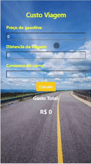

<h1 align="center">
   Calculadora para saber custo de uma viagem
</h1>

 

## 💻 Projeto

O projeto foi desenvolvido com o objetivo de fazer uma calculadora que gere o custo de uma determinada viagem.
Exemplo: O usuario ira inserir o preço da gasolina, a distancia em Km da viagem, e o consumo de seu carro entao sera calculado o valor medio que este usuario ira gastar para realizar a viagem.

## :camera: Demonstração

  

## ⚙ Configuração

1- Pré requisitos
-> Node Js 
-> Git Bash
-> Visual Studio Code

2- Para iniciar a aplicação:
> Baixar o arquivo do projeto
-> Extrair o arquivo
-> Abrir a pasta com Git Bash

3- Instalar dependencias 
-> npm i

4- Iniciar Aplicaçao 
-> code .
-> ionic serve -o

## :rocket: Tecnologias

Esse projeto foi desenvolvido com as seguintes tecnologias:

✔️Typescript

✔️SCSS

✔️JavaScript

✔️HTML

---
